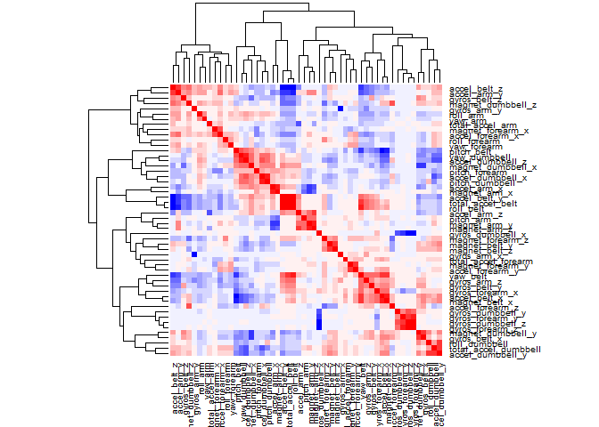

# Predicting Exercise Quality using a Random Forest Model
<b><u>Background:</u></b><br>
The purpose of this report is to create a model to determine if a weight lifting exercise was done correctly, based on data collected from accelerometers used during barbell exercises.  Six test subjects wore accelerometers on their arm, forearm, belt and dumbbell while performing the exercise.   The subjects were asked to perform the exercises correctly as well as incorrectly in five different ways.  The movements were classified with a letter : A, B, C, D, or E.  A classification of "A" meant the exercise was performed correctly while the other four letters classified common mistakes during weight training.     The models built for this report will attempt to classify the correct movements as well as the incorrect movements as accurately as possible.<br><br>

More information on the dataset can be found here: <br>
http://groupware.les.inf.puc-rio.br/har<br><br>

<b><u>Data Processing and Tidying:</u></b><br>


```r
library(caret)
```

```
## Loading required package: lattice
```

```
## Warning: package 'lattice' was built under R version 3.2.2
```

```
## Loading required package: ggplot2
```
The data set is very large with over 19,000 observations of 160 variables.  In addition, there are a large number of missing data points in the data set as well.  So, when we import the data we will set several different values to "na" that don't contain actual data so that we can easily remove them.  We'll try to build a model to start with only the variables that have all of their data present.


```r
train_test <- read.csv('https://d396qusza40orc.cloudfront.net/predmachlearn/pml-training.csv', 
                  na.strings=c('#DIV/0', '', 'NA') ,stringsAsFactors = F)

dim(train_test)
```

```
## [1] 19622   160
```

```r
sum(is.na(train_test))
```

```
## [1] 1921600
```

```r
table(colSums(is.na(train_test)))
```

```
## 
##     0 19216 
##    60   100
```
There are 1.92 million missing data points.  It looks like 60 of the columns are intact while 100 have exactly the same number of missing data.  If there were a small number of missing data points we might try to use imputation to fill them in, but in this case there are just way too many so we'll go with our variables that have complete data and get rid of the rest.


```r
#remove the columns that have any na's in them
data2 <- train_test[ , ! apply( train_test , 2 , function(x) any(is.na(x)) ) ]

#get rid of first 7 columns which don't have any data that we need
data3 <- data2[,-c(1:7)]
```
We'll also get rid of the first seven columns as well, as these contain information that don't relate to the acclerometer results used during the movements.<br>
The variable that we will be trying to predict is the "classe" variable.  In order for our model to run correctly we convert this to a factor variable.

```r
data3$classe <- as.factor(data3$classe)
set.seed(133)
inTraining <- createDataPartition(data3$classe, p=.75, list=F)
training  <- data3[inTraining,]
validation <- data3[-inTraining,]
```
We'll be using cross validation in our models. We divide up our data set into a training and a validation set.  We put 75% of the cases in the training set and 25% in the validation set.  We'll build our model on the training set and then test it on the validation set.  Doing this will help us pick the variables for our model, the type model to use and what parameters we should use in the model.<br><br>

<b><u>Model Selection:</u></b><br>
Now, let's try and determine what type of model to use.  There are still a large number of variables, let's look a their correlations to determine if that might give us some guidance on what model to use.  I create a correlation matrix and then a heatmap of the matrix to give me a sense of how correlated the variables are.


```r
x <- cor(data3[,-53])
col<- colorRampPalette(c("blue", "white", "red"))(20)
heatmap(x = x, col = col, symm = TRUE)
```

 


Based on the heatmap, it doesn't look like there are very many variables that are highly correlated.  We are trying to predict five different classes of movements based on a large number of possibly weak predictors.  Based on that information, I'm going to try a boosting model first.  I'll also try a random forest model, which is also good for making classification predictions.  We'll also be using k-fold cross-validation in our models with k-folds set to 2.  Normally, you'd like to use 10 for k-folds, but with the large number of variables, I'm going to start with two and see how our models perform.  In our first model, we'll use all of the variables in the data set to start.  Using a small k is going to give us more bias, but also less variance.  This will probably mean we won't get as good of an estimate on the out of sample error rate.
The random forest model can cause slow performance on my computer so I'm going to use parallel processing in order to try to speed things up.  I'm using code for the parallel processing I found in a tutorial by Leonard Greski that can be found <a href="https://github.com/lgreski/datasciencectacontent/blob/master/markdown/pml-randomForestPerformance.md">here.</a>

```r
library(parallel)
library(doParallel)
```

```
## Loading required package: foreach
## Loading required package: iterators
```

```r
cluster <- makeCluster(detectCores() - 1) 
registerDoParallel(cluster)

fitControl <- trainControl(method = "cv",
                           number = 2,
                           allowParallel = TRUE)
```
Below is the code for the boosting model using all of the variables in the training set and predicting on "classe."  We then make predictions on the model using the training set just to see what it looks like.

```r
modFit <- train(classe ~ ., method="gbm",data=training,trControl = fitControl, verbose=F)
```

```
## Loading required package: gbm
```

```
## Warning: package 'gbm' was built under R version 3.2.3
```

```
## Loading required package: survival
## 
## Attaching package: 'survival'
## 
## The following object is masked from 'package:caret':
## 
##     cluster
## 
## Loading required package: splines
## Loaded gbm 2.1.1
## Loading required package: plyr
```

```r
pred_boost <- predict(modFit, training)
confusionMatrix(training$classe, pred_boost)
```

```
## Confusion Matrix and Statistics
## 
##           Reference
## Prediction    A    B    C    D    E
##          A 4150   28    3    2    2
##          B   65 2732   50    1    0
##          C    0   51 2478   36    2
##          D    3    5   66 2322   16
##          E    0    9   15   28 2654
## 
## Overall Statistics
##                                           
##                Accuracy : 0.974           
##                  95% CI : (0.9713, 0.9766)
##     No Information Rate : 0.2866          
##     P-Value [Acc > NIR] : < 2.2e-16       
##                                           
##                   Kappa : 0.9672          
##  Mcnemar's Test P-Value : 5.675e-08       
## 
## Statistics by Class:
## 
##                      Class: A Class: B Class: C Class: D Class: E
## Sensitivity            0.9839   0.9671   0.9487   0.9720   0.9925
## Specificity            0.9967   0.9902   0.9926   0.9927   0.9957
## Pos Pred Value         0.9916   0.9593   0.9653   0.9627   0.9808
## Neg Pred Value         0.9935   0.9922   0.9890   0.9946   0.9983
## Prevalence             0.2866   0.1919   0.1775   0.1623   0.1817
## Detection Rate         0.2820   0.1856   0.1684   0.1578   0.1803
## Detection Prevalence   0.2843   0.1935   0.1744   0.1639   0.1839
## Balanced Accuracy      0.9903   0.9787   0.9707   0.9823   0.9941
```
The training model is highly accurate at 97.4% which is not a huge surprise since we made the predictions based on the same data we used to build the model.  Now, let's make some predictions on the validation data.  I would expect our accuracy rate to be lower on the validation set.


```r
pred_boost2 <- predict(modFit, validation )
confusionMatrix(validation$classe, pred_boost2)
```

```
## Confusion Matrix and Statistics
## 
##           Reference
## Prediction    A    B    C    D    E
##          A 1376   12    4    3    0
##          B   32  886   29    2    0
##          C    0   31  809   12    3
##          D    1    1   20  774    8
##          E    2    7    9   17  866
## 
## Overall Statistics
##                                           
##                Accuracy : 0.9606          
##                  95% CI : (0.9548, 0.9659)
##     No Information Rate : 0.2877          
##     P-Value [Acc > NIR] : < 2.2e-16       
##                                           
##                   Kappa : 0.9502          
##  Mcnemar's Test P-Value : 0.0004439       
## 
## Statistics by Class:
## 
##                      Class: A Class: B Class: C Class: D Class: E
## Sensitivity            0.9752   0.9456   0.9288   0.9579   0.9875
## Specificity            0.9946   0.9841   0.9886   0.9927   0.9913
## Pos Pred Value         0.9864   0.9336   0.9462   0.9627   0.9612
## Neg Pred Value         0.9900   0.9871   0.9847   0.9917   0.9973
## Prevalence             0.2877   0.1911   0.1776   0.1648   0.1788
## Detection Rate         0.2806   0.1807   0.1650   0.1578   0.1766
## Detection Prevalence   0.2845   0.1935   0.1743   0.1639   0.1837
## Balanced Accuracy      0.9849   0.9648   0.9587   0.9753   0.9894
```
The accuracy rate is lower on the validation set, but not that much lower.  The accuracy was 96.1% which might give us some indication of what our out of sample error rate would be if we decided to use this model on a different data set.   <br><br>

Our second model is going to be a random forest and we'll train it using the training data set.

```r
fit <- train(classe ~ ., method="rf",data=training, trControl = fitControl)
```

```
## Loading required package: randomForest
## randomForest 4.6-10
## Type rfNews() to see new features/changes/bug fixes.
```
So, we've got our model built, let's see how it does on the validation set.

```r
x <- predict(fit, validation)
confusionMatrix(validation$classe,x)
```

```
## Confusion Matrix and Statistics
## 
##           Reference
## Prediction    A    B    C    D    E
##          A 1393    0    1    0    1
##          B    8  940    1    0    0
##          C    0    6  841    8    0
##          D    0    0   11  791    2
##          E    0    0    3    2  896
## 
## Overall Statistics
##                                           
##                Accuracy : 0.9912          
##                  95% CI : (0.9882, 0.9936)
##     No Information Rate : 0.2857          
##     P-Value [Acc > NIR] : < 2.2e-16       
##                                           
##                   Kappa : 0.9889          
##  Mcnemar's Test P-Value : NA              
## 
## Statistics by Class:
## 
##                      Class: A Class: B Class: C Class: D Class: E
## Sensitivity            0.9943   0.9937   0.9813   0.9875   0.9967
## Specificity            0.9994   0.9977   0.9965   0.9968   0.9988
## Pos Pred Value         0.9986   0.9905   0.9836   0.9838   0.9945
## Neg Pred Value         0.9977   0.9985   0.9960   0.9976   0.9993
## Prevalence             0.2857   0.1929   0.1748   0.1633   0.1833
## Detection Rate         0.2841   0.1917   0.1715   0.1613   0.1827
## Detection Prevalence   0.2845   0.1935   0.1743   0.1639   0.1837
## Balanced Accuracy      0.9969   0.9957   0.9889   0.9922   0.9977
```
You can see based on the results the model performed very well on the validation set.  The accuracy was above 99%.  In addition, the model had high sensitivity and specificity for each of the five classifications.  It not only performed well when the exercises were performed correctly (category A), it also performed well when the exercises weren't performed correctly (category B, C, D, E).<br>
I'm pretty surprised the model performed as well as it did with all of the variables present.  The in sample error rate is less than one percent for this model.  Normally, the out of sample rate is higher than the in sample rate.  I would expect the out of sample error rate for this model to be much higher.  It's possible the size of the data set has made it easier to fit a model that will have a lower out of sample error rate.<br>
Based on the two models that were created, it appears the random forest performed better on the training and validation sets than the boosting model.  So, the random forest model is what I would run on the testing or another data set.
<br><br>
In order to see how our model performed on the actual test set, I process this data in the same way, removing all of the NA's and blank fields from the data and the first seven columns. And then I run my model on the test data.

```r
test1 <- read.csv('https://d396qusza40orc.cloudfront.net/predmachlearn/pml-testing.csv', 
                       na.strings=c('#DIV/0', '', 'NA') ,stringsAsFactors = F)

test2 <- test1[ , ! apply( test1 , 2 , function(x) any(is.na(x)) ) ]
test3 <- test2[,-c(1:7)]

y <- predict(fit, test3)
```
I was very surprised at how well the model performed.  The deadline hasn't passed yet on Quiz 4 so I won't print out my results, but my model scored a 20/20 on the quiz.  Ordinarily, you wouldn't expect your out of sample error rate to be equivalent or better than your in sample error.  However, in this case that is what happened.

<b><u>Conclusion:</u></b><br>


In conclusion, the random forest model was superior to a boosting model in terms of predicting the classification of five different movements.  The random forest model had an in sample error rate of less than 1%.  Normally, the out of sample error rate of a model is always higher than the in sample error rate due to overfitting.  However, when the random forest model was used on a different data set the model predicted 20 out of 20 correctly.  It should be noted the new data set did have a small number of cases which might have overinflated the accuracy of the model.
